# JAVA 并发编程

## 基础知识

### 缓存一致性协议

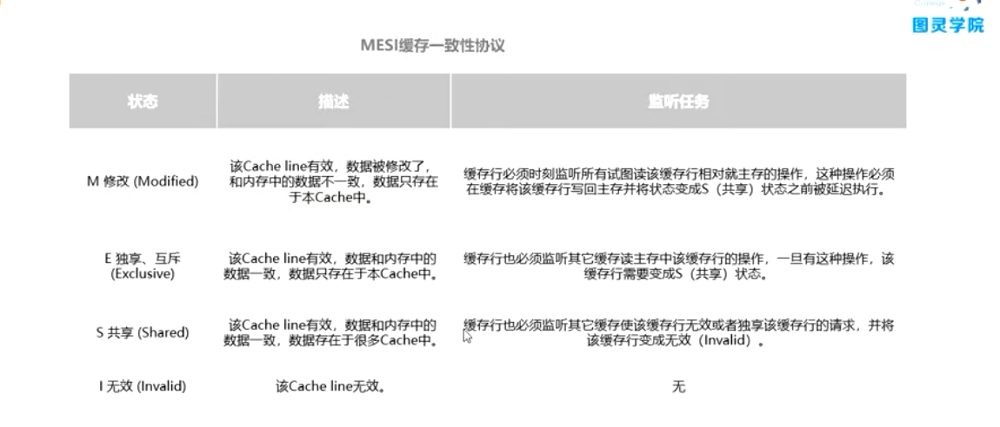

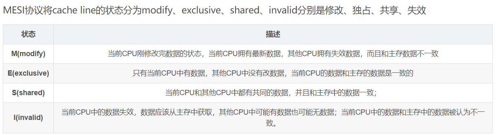

1. 如果两个cpu同时对缓存中相同的数据进行了操作，并且想要保存到主存中，这样在一个指令周期内会对两个cpu的指令进行裁决，决定执行那个cpu的指令并保存相应数据。
2. 缓存行：CPU缓存的最小存储单元
3. 机械硬盘的最小存储单元：簇
4. 总线锁和缓存一致性是锁的粒度不同
5. 什么情况下缓存一致性协议会失效：
   1. 缓存行失效：存储变量的存储长度大于缓存行的长度。这时候只能加总线锁
   2. CPU本身不支持缓存一致性协议

### JAVA线程

#### 线程的五种状态

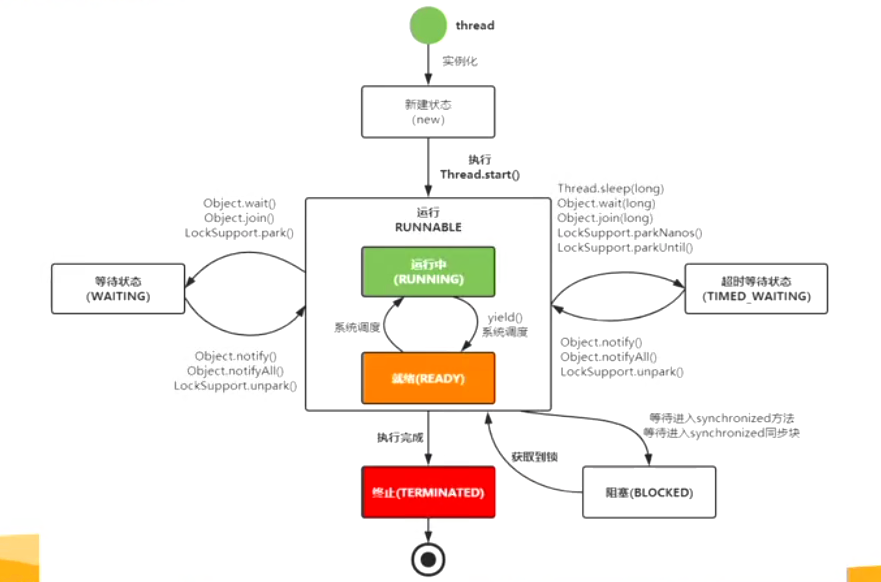

1. 进程是系统分配资源的基本单位，线程是cpu调度的基本单位
2. 使用用户级线程可以避免过度创建线程
3. 用户级线程和内核级线程的理解：https://juejin.im/post/6844903962504593421 
4. 上下文切换时需要将当前运行结束的时间片的线程数据（指令 程序指针 中间数据）刷新到内核栈中（linux Tss 任务状态断）
5. 为什么要用到并发：
   1. 充分利用多核CPU的计算能力
   2. 方便进行业务拆分，提升应用性能
6. 并发产生的问题：
   1. 高并发场景下，导致频繁的上下文切换
   2. 临界区县城安全问题，容易出现死锁
      1. java 排查死锁的工具 jsp

### JMM java 内存模型  --- java 线程内存模型

#### 理解

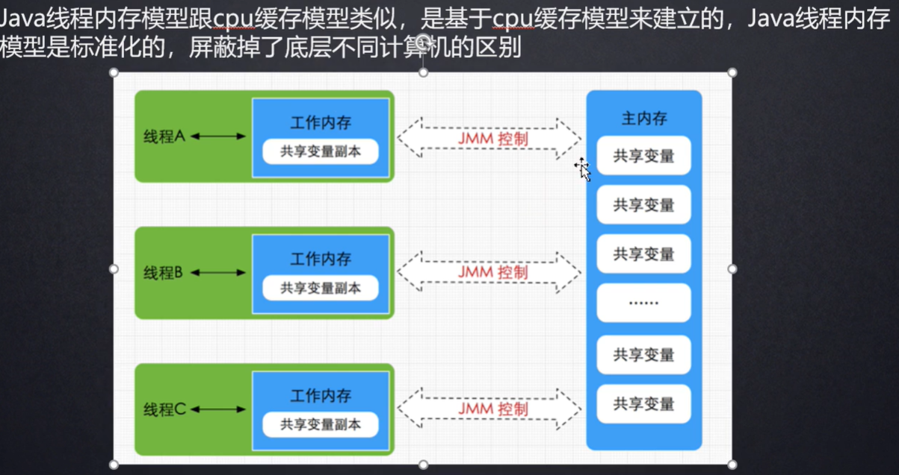

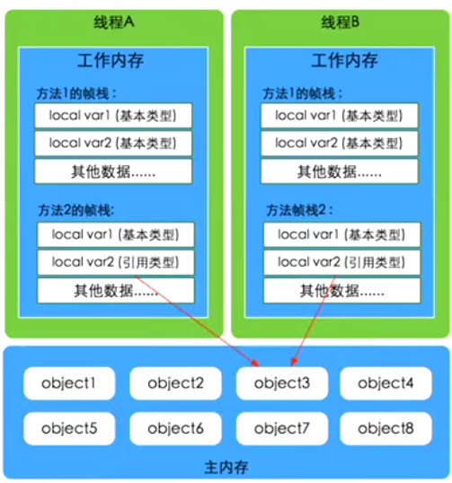

1. JMM与JVM内存区域的划分是不同的概念层次，应该加JMM理解为是一组规则，通过这组规则控制程序中各个变量在共享数据区域和私有数据区域的访问方式
   1. JVM围绕原子性、有序性、可见性展开
2. JVM内存区域的划分是逻辑上划分，操作的是逻辑空间
3. 图中 主内存 是硬件环境下的内存条的抽象
4. 工作内存是cpu缓存的抽象
5. 这种抽象是为了屏蔽底层的操作系统的不同，实现兼容

#### java 八大内存交互操作

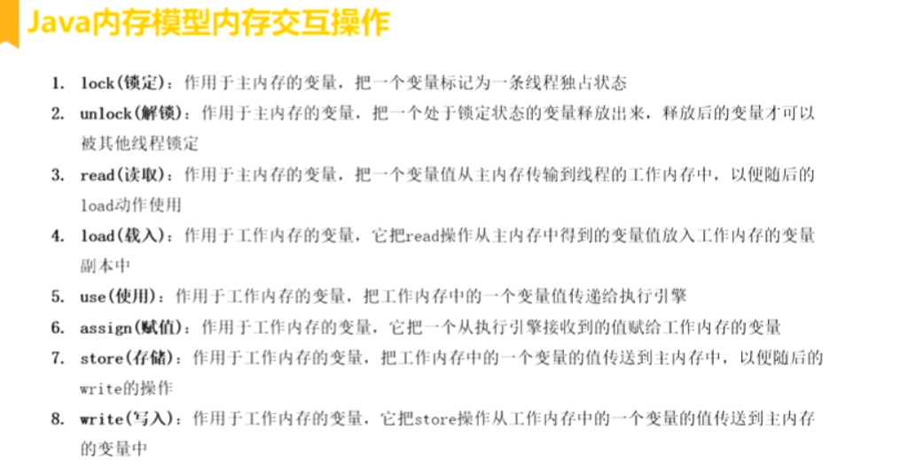

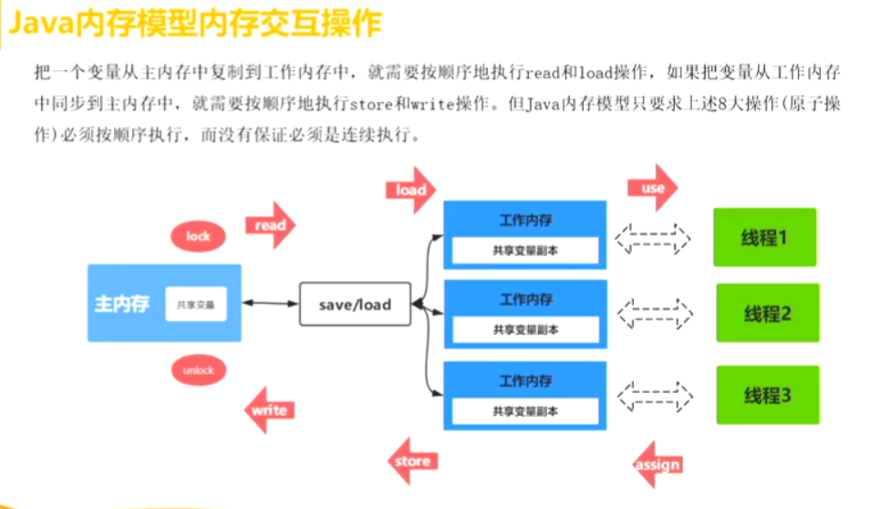

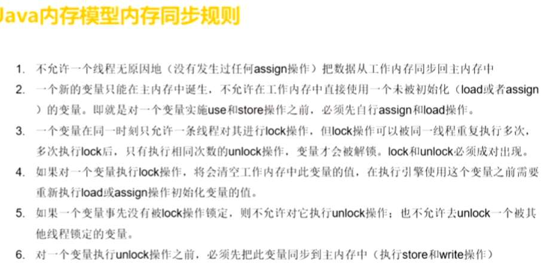

1. 八大操作是顺序执行的，但是没有必要是连续执行的
2. read和load是一起执行的，store和write的连续执行的


#### volatile 关键字 内存可见性 有序性

1. 加上volatile关键字之后 可以 实现类似缓存一致性的嗅探操作，实现变量的同步更改

2. 没有实现原子性，所以下面的代码还是无法保证多线程结果的准确。因为Volatile实现了内存的可见性，当一个线程最先改变变量的时候，变量状态变为（M），此时其他线程已经执行的++操作导致的变量结果的改变会变成无效的缓存，导致部分循环操作无效。

3. 过多使用volatile关键会造成总线风暴，过多的监听总线信息

   ```java
   public class VolatileAtomicSample {
   
       private static volatile int counter = 0;
   
       public static void main(String[] args) {
           for (int i = 0; i < 10; i++) {
               Thread thread = new Thread(()->{
                   for (int j = 0; j < 1000; j++) {
                       counter++; //不是一个原子操作,第一轮循环结果是没有刷入主存，这一轮循环已经无效
                       //1 load counter 到工作内存
                       //2 add counter 执行自加
                       //其他的代码段？
                   }
               });
               thread.start();
           }
   
           try {
               Thread.sleep(1000);
           } catch (InterruptedException e) {
               e.printStackTrace();
           }
   
           System.out.println(counter); #输出的结果小于等于 10000
       }
   
   }
   ```


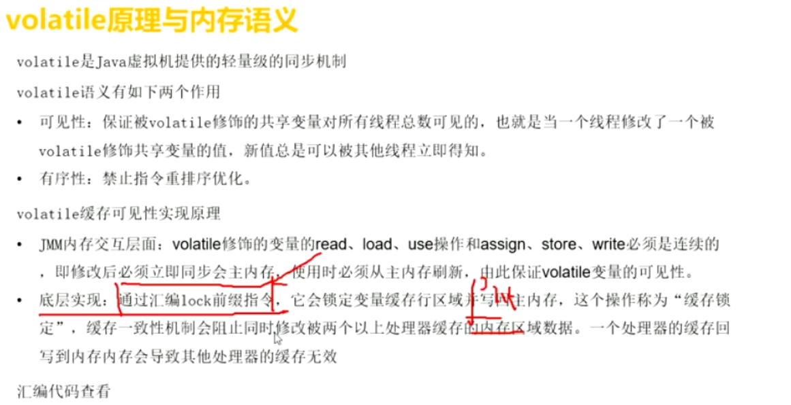

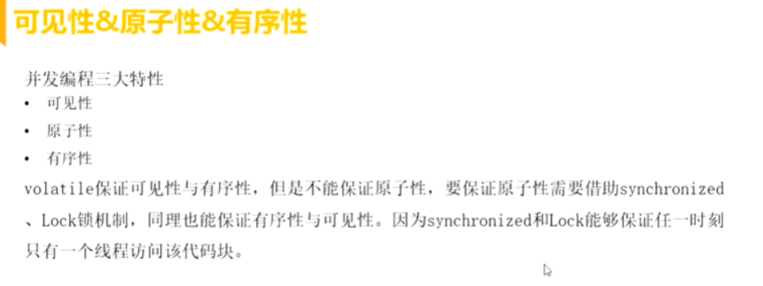

#### 指令重排

```java
public class VolatileReOrderSample {
    private static int x = 0, y = 0;
    private static int a = 0, b =0;
    static Object object = new Object();

    public static void main(String[] args) throws InterruptedException {
        int i = 0;

        for (;;){
            i++;
            x = 0; y = 0;
            a = 0; b = 0;
            Thread t1 = new Thread(new Runnable() {
                public void run() {
                    //由于线程one先启动，下面这句话让它等一等线程two. 读着可根据自己电脑的实际性能适当调整等待时间.
                    shortWait(10000);
                    a = 1; 
                    x = b; 
                }
            });
            Thread t2 = new Thread(new Runnable() {
                public void run() {
                    b = 1;
                    y = a;
                }
            });
            t1.start();
            t2.start();
            t1.join();
            t2.join();

            /**
             * cpu或者jit对我们的代码进行了指令重排？
             * 1,1
             * 0,1
             * 1,0
             * 0,0 cpu或者JIT对代码进行了指令重排
             */
            String result = "第" + i + "次 (" + x + "," + y + "）";
            if(x == 0 && y == 0) {
                System.err.println(result);
                break;
            } else {
                System.out.println(result);
            }
        }

    }
```

1. 为什么会进行指令重排？
2. 指令重排发生在哪个阶段？
   1. 发生在JIT及时编译阶段
   2. cpu在执行汇编指令的时候也会发生指令重排
3. 怎么避免发生指令重排：
   1. volatile关键字 可以在编译阶段增加内存屏障 禁止指令重排
   2. 直接使用内存屏障
4. 单列情况

```
public class Singleton {

    /**
     * 查看汇编指令
     * -XX:+UnlockDiagnosticVMOptions -XX:+PrintAssembly -Xcomp
     */
    private volatile static Singleton myinstance;

    public static Singleton getInstance() {
        if (myinstance == null) {
            synchronized (Singleton.class) {
                if (myinstance == null) {
                    myinstance = new Singleton();//对象创建过程，本质可以分文三步 没有原子性
                    //申请地址空间
                    //实例化对象
                    //myinstance <- 地址空间
                }
            }
        }
        return myinstance;
    }
```

#### 内存屏障

1. 四种内存屏障
   1. storestore 写写
   2. storeload 写读
   3. loadload 读读
   4. loadstore 读写

#### 问题

1. 既然CPU有MESI缓存一致性协议，为什么JMM还需要volatile 关键字？
   1. 首先MESI的为了保证存在多级缓存的多核cpu或者多个cpu之间共享变量的一致性，（不能保证所有情况，还需要其他操作来继进行，针对不同的操作系统和架构有不同的解决方案），但是volatile关键字是高级语言给开发者提供的用来保证多个线程共享变量之间的可见性，屏蔽了底层操作系统的不同实现。
   2. 在JVM和底层操作系统系统进行交互式会将volatile关键字进行指令编译来达到开发者想要实现的目的。
2. java内存模型抽象了不同系统的内存缓存机制，但是本身java的字节码还是需要编译为一个个指令交由操作系统执行，在这期间社怎么将java内存模型达到的缓存一致性通知给操作系统呢？
3. 指令重排是在什么情况下进行的：程序编译的时候进行，程序执行过程中遇到等待操作时进行？ 

### Synchronized

1. 多个线程访问一个 共享的 可变的 资源情况，这种资源可能是：对象、变量、文件等 < -- 临界资源

2. 锁的种类

   1. 显式锁：ReentrantLock, 实现JUC里的Lock，实现是基于AQS实现，需要手动加锁和解锁
   2. 隐式锁：Synchronized 加锁机制。 JVM内置锁，不需要手动加锁与解锁，JVM会自动加锁跟解锁

   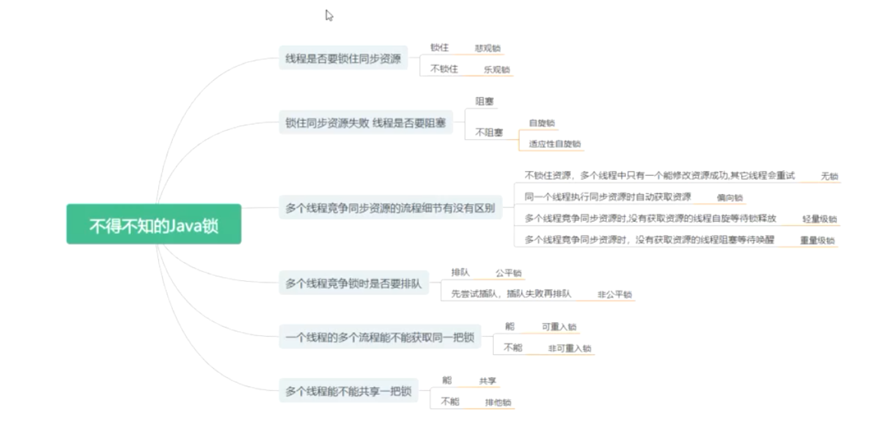

3. 加锁的目的：并发线程序列化的访问临界资源

4. 加到方法上：

   ```java
   Class Bean{
       //加到非静态方法上,，Bean是由容器管理的，这时 Bean 需要为单例模式
       public Synchronized test{
           
       }
       // 加到静态方法上，是加在了类上面
       public static Synchronized test{
           
       }
       
       //夸对象加锁
       public void test1(){
       	UnsafeInstance.reflectGetUnsafe().monitorEntor(object);    
       }
       public void test2(){
       	UnsafeInstance.reflectGetUnsafe().monitorExit(object);    
       }
   }
   ```

5. Synchronized 使用与原理

   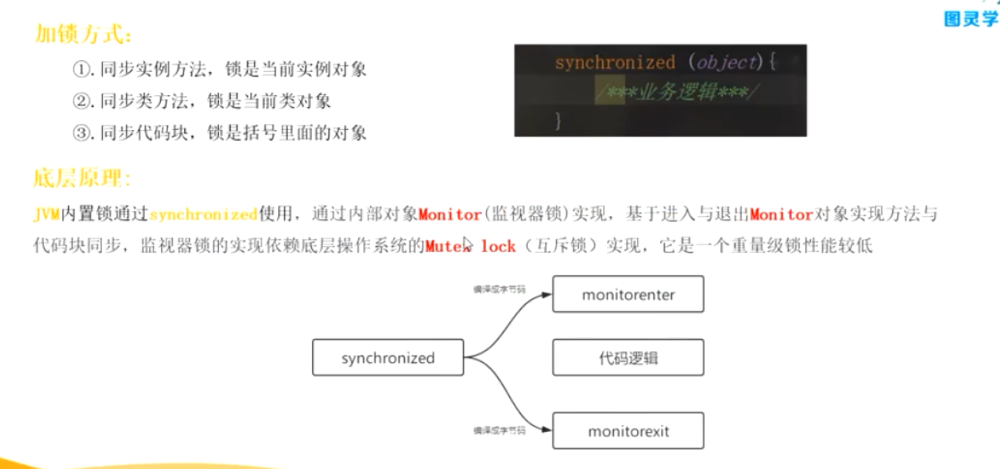

6. 是可重入锁，对同一个对象可以多次加锁

#### 对象的内存结构


1. 实例对象内存中存储在哪？ 

   1. 如果实例对象存储在堆区时：实例对象数据存在堆区，实例的引用存在栈上，实例的元数据class存在方法区或者元空间
   2. Object实例对象一定存在堆区吗？不一定 原因：如果实例对象没有线程逃逸行为，则存储在当前线 程的线程栈中

   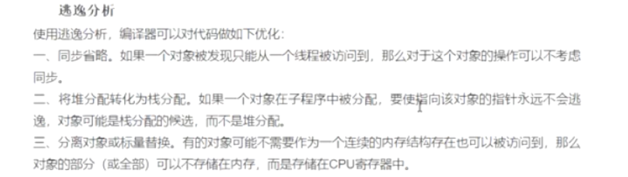

2. 锁的粗化 ？ 

3. 锁的消除 ？

4. 锁的状态是怎么转换的？

   

