## 基础概念

1. 引用类型没有赋值默认为null

### final关键字

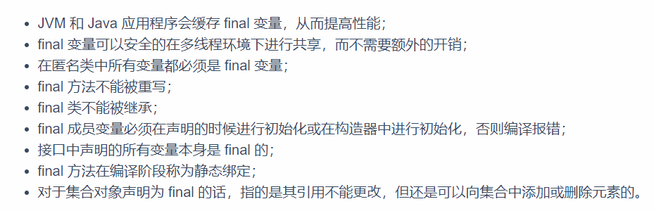

### 枚举类型 Enum

```java
public enum Size {
    SMALL("S", 1), MEDIUM("M", 2), LARGE("L", 3), EXTRA_LARGE("XL", 4); //这里相当于四个Size枚举类型的实例

    private String abbrevation;
    private int index;
    private Size(String abbrevation, int index){
        this.index = index;
        this.abbrevation = abbrevation;
    }

    public String getAbbrevation() {
        return abbrevation;
    }

    public void setAbbrevation(String abbrevation) {
        this.abbrevation = abbrevation;
    }

    public int getIndex() {
        return index;
    }

    public void setIndex(int index) {
        this.index = index;
    }
}
```

## lambda 表达式


## 注解 Annotation

### 什么是注解 、注解的作用 、在哪里使用注解


1. 注解还有检查和约束的作用

### 内置注解


1. @SuppressWarnings 可以压制警告，告诉编译器不要去做检查，比如定义了为使用的变量会在编译器中生成提示，可以使用SuppressWarning 消除。
2. 可以在方法上，也可以在类上


### 元注解


1. @Target 约束注解 在方法、类等情况使用

### 自定义注解


1. 默认值为 -1  代表找不到

## 反射 Reflection

### 反射机制概述

 #### 什么是动态语言 什么是静态语言


#### Class 类


##### class 类的创建方式

1. 通过对象获得
2. 通过Class.forname()获得
3. 通过类名获得
4. 每个内置类型的包装类都有一个type属性


1. 获取父类类型


##### 所有类型的class对象

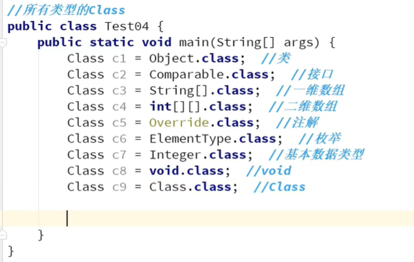

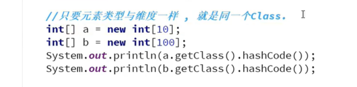

##### 类的初始化

1. 静态代码块初始化
2. 构造器初始化
3. 静态代码块的值和其编写顺序有关

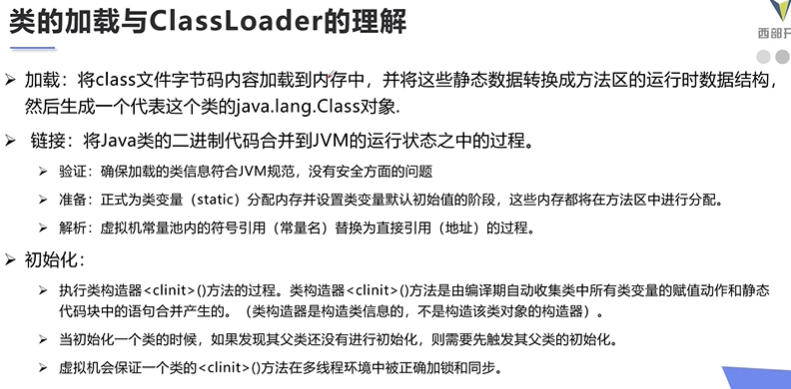

类什么时候回初始化：

1. new() 创建对象 父类没有加载，先初始化父类
2. 反射会产生主动引用

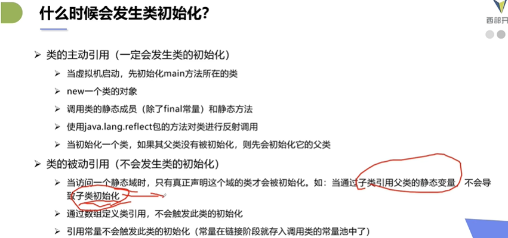

##### 类加载器

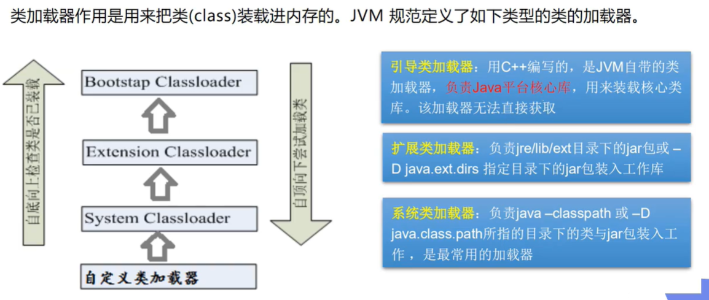

#### 反射机制


##### 获取类的信息


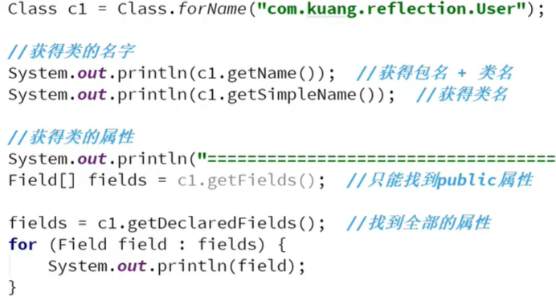

##### 通过反射构建和使用类的属性和方法

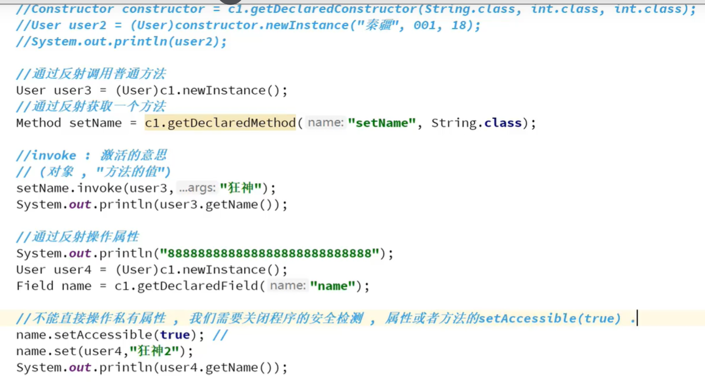

#### 效率问题

1. 反射会降低程序的效率
2. 使用反射较多可以关闭检测机制 提高运行效率

#### 反射操作注解

使用：ORM 类和数据库表之间的对应关系

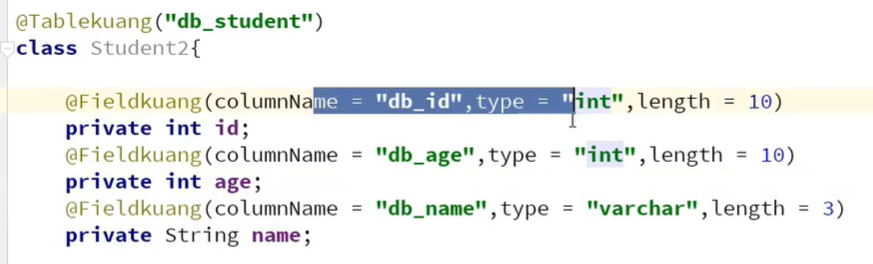

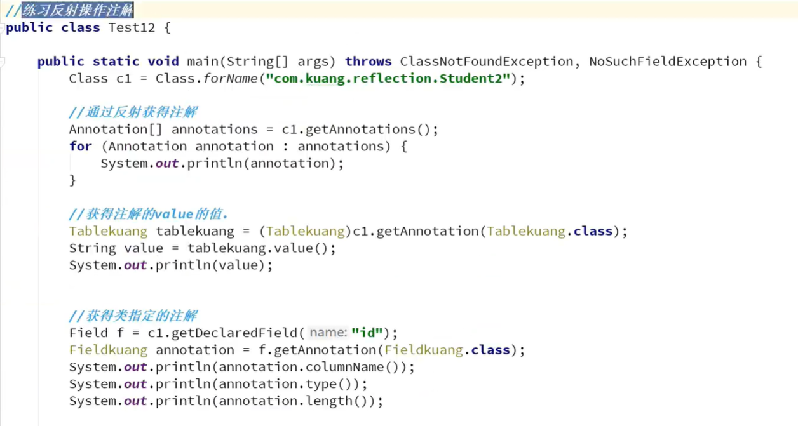

## java集合

1. 会使用集合存储数据
2. 会便利集合，把数据取出来
3. 掌握每种集合的特性

### java集合集成结构

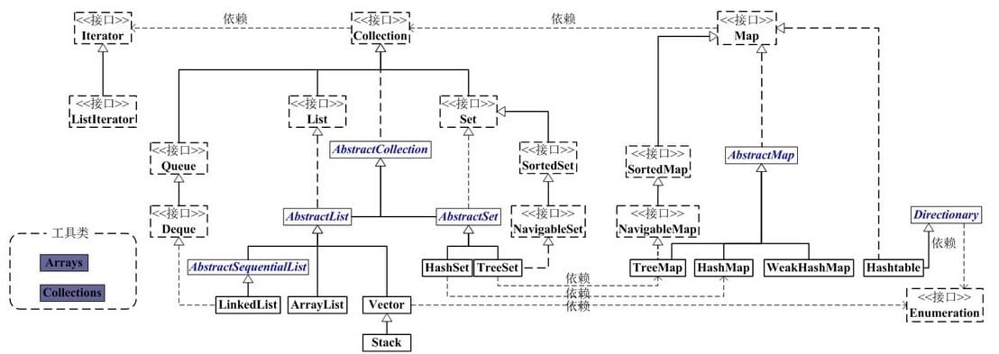

### Collection接口常用功能

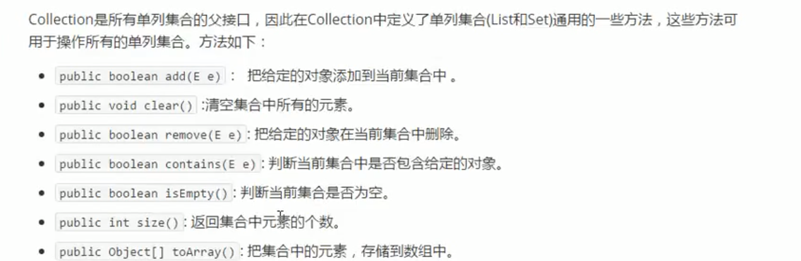

### Itreator  接口功能

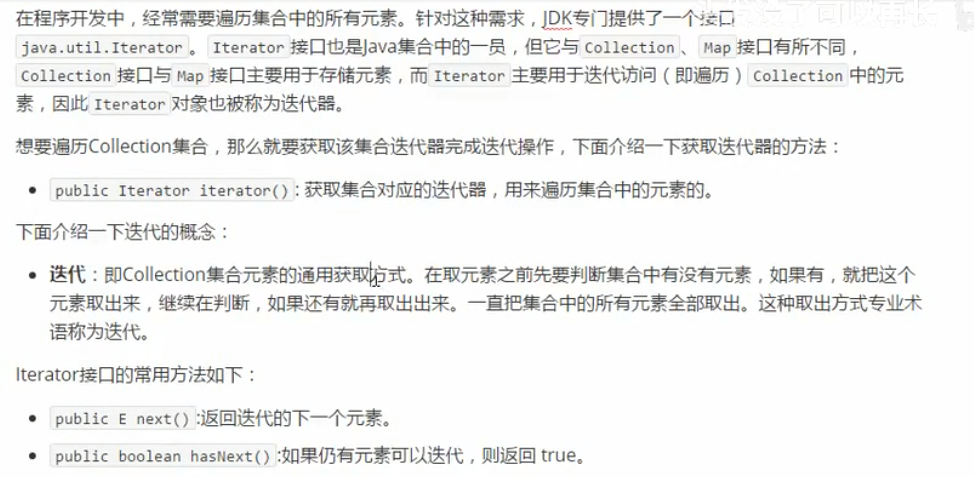

1. 迭代器的remove操作需要在next之后进行，即删除上一个访问的元素

### java库中的具体集合

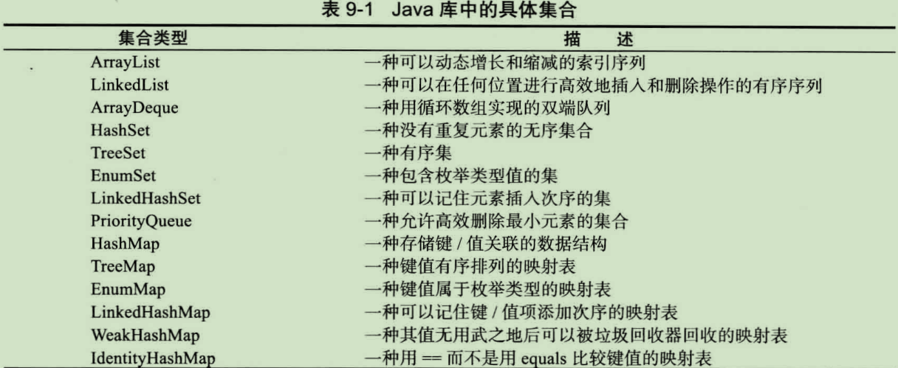

### Vector

1. Vector是线程安全的

### ArrayList

1. 为什么需要ArrayList，原生数组有什么缺点。
2. ArrayList和LinkedList的区别
3. ArrayList中elementData为什么被transient修饰？
   1. ArrayList在序列化的时候会调用writeObject，直接将size和element写入ObjectOutputStream；反序列化时调用readObject，从ObjectInputStream获取size和element，再恢复到elementData。
   2. 为什么不直接用elementData来序列化，而采用上诉的方式来实现序列化呢？原因在于elementData是一个缓存数组，它通常会预留一些容量，等容量不足时再扩充容量，那么有些空间可能就没有实际存储元素，采用上诉的方式来实现序列化时，就可以保证只序列化实际存储的那些元素，而不是整个数组，从而节省空间和时间
4. 底层实现
   1. 扩容时使用 移位运算 >> 1 除 2 ,1 << 乘 2
   2. 使用了引用类型，所以需要在移除元素或者清空数组的时候，将未被使用的区域置为null，不然 gc机制无法回收

### LinkedList

1. 是双向链表

### ArrayDeque

1. 集成了List和Deque接口，是一个双端队列，可以用来实现栈和队列的操作，底层是一个循环数组。
2. 具体使用要看看 push pop  和 getLast addLast操作的元素的位置

### HashMAp 原理讲解

#### JDK7 HashMap

1. 实现数据结构：数组+链表

2. HashMap 插入节点的时候要判断key值是否已经存在，这里要产生遍历，为什么不使用尾插法，而要使用头插法？
   1. 如果查找到，就直接覆盖原val
   2. 如果没找到，就已经便利到尾部了，为什么不直接插入到尾部，而要使用头插法
      1. 我们一般认为后插入的数据比较热，所以当遇到查询节点的时候可能会节省遍历查询对比的时间
   
3. 初始化数组为什么要是 2 的幂次函数？
   1. hashmap 进行数组下标运算的时候，采用的是 h & (lenth - 1)，这里lenth 是2的幂次方 可以满足 计算得到的数组下标 在（0-lenth）之间，并且满足平均分配。
   2. 位操作比较快
   
4. 为什么计算hashcode 时进行了很多的 位移操作？
   
   1. 不进行位移操作的话 hashcode的高位无法参与到 计算数组下标的过程中
   
5. 扩容操作：

   1. 让每个table存储的链表变短，提高get效率。同时扩容之后，hash 索引会更改，所以要重新计算目标数组的索引
   2. 扩容条件：size > threshold = 加载因子 * 现在数组的长度。table[bucketIndex] != null ?
   3. 转移操作也是使用的头插法
   4. 多线程会造成循环链表：第一 和 第二个线程 同时进入扩容模块的第一次循环，并且第二个线程卡住，第一个线程执行完毕扩容操作，第二个线程开始执行会出现。出现原因，next2指针和e2指针顺序颠倒了，并且扩容的时候使用的是头插法。

   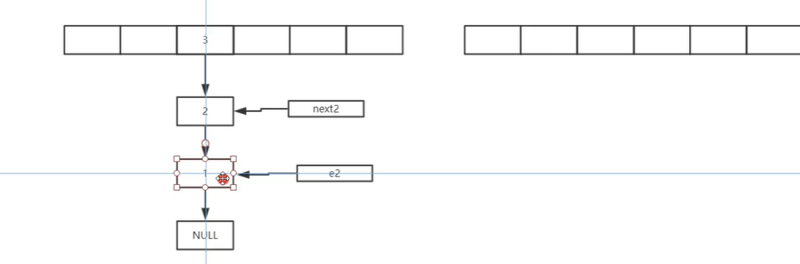

   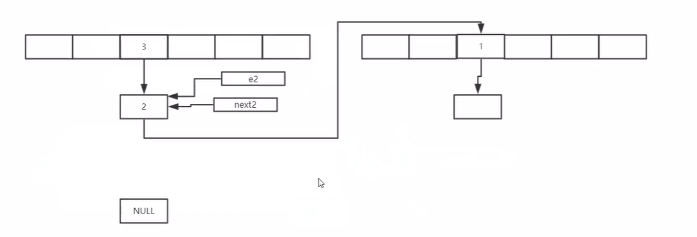

   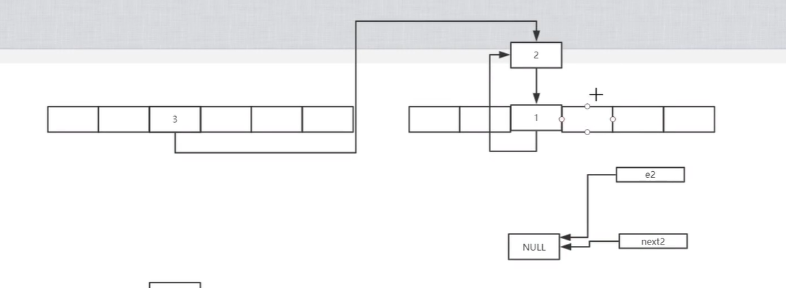

6. modCount

   1. hashmap不是线程安全的，提供modCount是为了在出现并发问题（一个遍历，一个修改）时，可以快速失败
   2. 代表修改次数 在 add 和 remove 是会进行 modCount++
   3. 下面的代码会报错，在调用key值迭代器遍历key时，如需删除 需要使用 key值迭代器的remove操作，这里会同步迭代器的记录修改此处的变量

   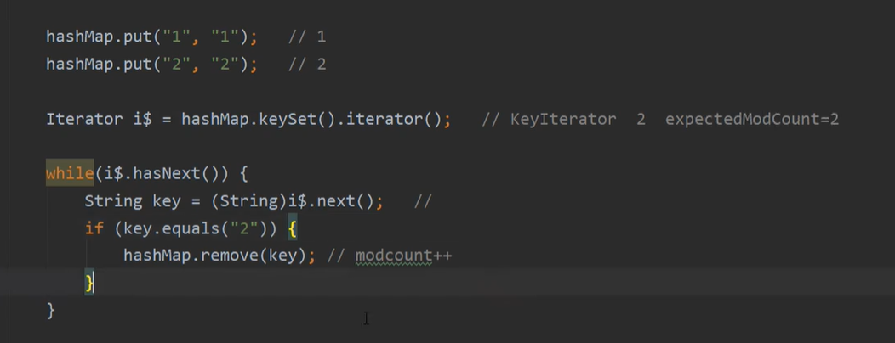

   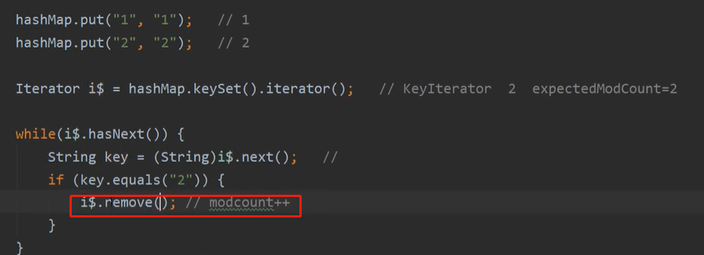

```java
//自己实现HashMap的思路
//给定一个数字 number，找到大于等于这个数的2的幂次数
// 循环操作 从给定数字开始逐次加一 判断一下是否为 2 的幂次  
Integer.highestOneBit( (number - 1) << 1 ); // 减一操作主要是为了满足 number 本身就是 2 的幂次
Integer.highestOneBit( number )； //找到小于等于 number的幂次
lenth - 1  0000 1111 进行与操作就是保留了hashcode 的后四位的结果

capacity >= jdk.map.althashing.threshold // 设置环境变量，当数组容量超过我们的设定值之后，会重新给hash种子赋值，使得结果更加散列。接着数组扩容会进行rehash操作。

```

####  JDK ConcurrntHashMap

1. Segment 分段， 每个Segment 里面存储 HashEntry数组
2. 扩容先扩充每个Segment的 HashEntry 数组
3. Unsafe 操作
4. 计算Segment数组下标的时候为什么取高位计算
5. tryLock()在获取不到锁的时候不会阻塞，而可以干一些其他的事情 在CMap里面的其他事情是去遍历了一下链表，并尝试创建了新节点
6. lock()获取不到锁会阻塞

#### JDK8 HashMap

1. 使用红黑树来维护元素

2. 红黑树 为什么新插入的节点要着红色：红黑树中第五个性质规定，每个路径上的黑高度是相同的，如果新插入的节点着为黑色，就直接违反了红黑树的性质，而着为红色，如果其父节点是黑色的话仍然保持了红黑树的性质，不需要进行旋转操作来维护。

3. 插入时比较：先比较hashcode，如果设置了 key的比较器 进行比较， 最后比较 System.identityHashCode

4. 树化之前增加了双向链表，树化之后将树的根节点移动到双向链表的头结点（moveRootToFront）

5. jdk在扩容钱先判断一下当前的桶是不是空的，如果是空的则不进行扩容，等到下次产生冲突时在进行扩容

6. 扩容：

   1. ```java
      Node<K,V> loHead = null, loTail = null;
      Node<K,V> hiHead = null, hiTail = null;
      Node<K,V> next;
      do {
          next = e.next;
          if ((e.hash & oldCap) == 0) { 
              if (loTail == null)
                  loHead = e;
              else
                  loTail.next = e;
              loTail = e;
          }
          else {
              if (hiTail == null)
                  hiHead = e;
              else
                  hiTail.next = e;
              hiTail = e;
          }
      } while ((e = next) != null);
      if (loTail != null) {
          loTail.next = null;
          newTab[j] = loHead;
      }
      if (hiTail != null) {
          hiTail.next = null;
          newTab[j + oldCap] = hiHead;
      } // 链表情况下 将一个桶上的一个链表分成两个，分别放到新数组的相应桶上
      ```

7. JDK8 ConcurrneHashMap

   1. TreeBin 的作用 加锁更加方便 直接对整颗红黑树进行加锁，防止root节点改变之后其他线程错误上锁
