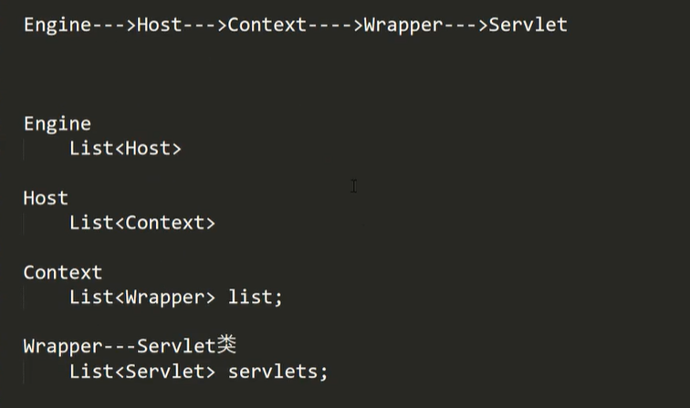
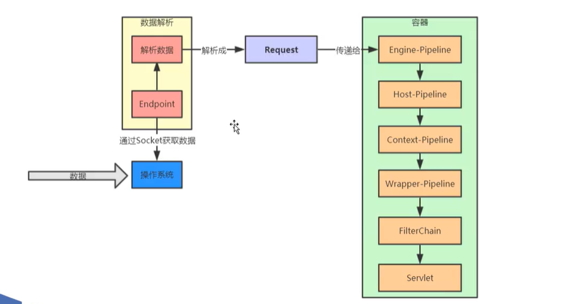

# tomcat

1. servlet 默认单例
2. wrapper 是 servlet 类类型， 每个wrapper 存放的是 对应servlet类的实例

## request 对象是怎么生成的

https 请求构建数据 通过 socket 调用 操作系统tcp协议传输数据 -- > 操作系统接受数据 -->   tomcat监听 nio bio 端口数据 -> 解析 ->上图

解析数据分为几个步骤

1. 获取 http 请求数据
2. 将socket处理包装
3. 扔给线程池处理
4. 解析请求行

## tomcat 取数据使用bio nio

## tomcat 和 springboot 是怎么结合的